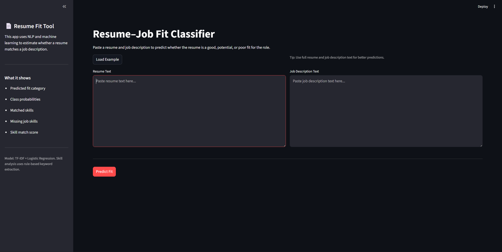
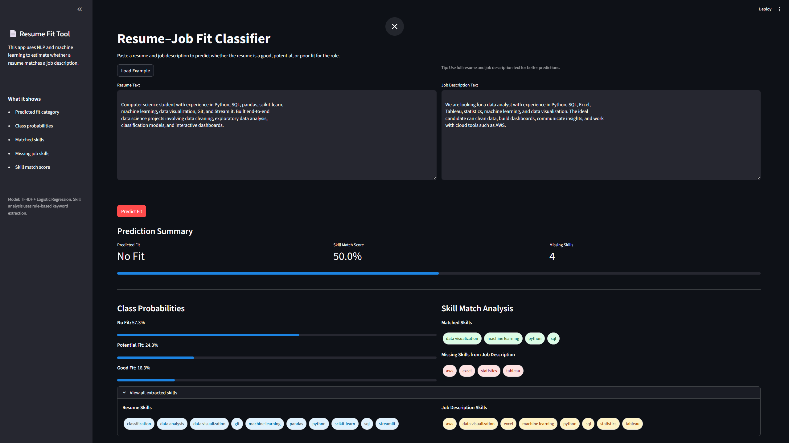

# Resume–Job Fit Classifier

An NLP-powered Streamlit app that predicts how well a resume matches a job description.  
The project combines a machine learning classifier with rule-based skill extraction to provide both a fit prediction and practical feedback on matched and missing skills.

## Demo




## Project Overview

Job seekers often tailor resumes manually for each application, but it can be hard to quickly identify whether a resume aligns with a job description. This project uses natural language processing to classify resume-job fit and highlight relevant skills found in both texts.

The app predicts one of three classes:

- Good Fit
- Potential Fit
- No Fit

It also provides:

- Class probability scores
- Skill match percentage
- Matched skills
- Missing skills from the job description
- Extracted resume and job description skills

## Features

- Loads resume-job description pairs from Hugging Face
- Combines resume text and job description text for NLP classification
- Trains a TF-IDF + Logistic Regression baseline model
- Evaluates model performance on a held-out test set
- Extracts technical skills using keyword-based matching
- Compares resume skills against job description skills
- Provides an interactive Streamlit interface
- Includes model comparison experiments

## Tech Stack

- Python
- pandas
- scikit-learn
- Hugging Face datasets
- Streamlit
- joblib
- matplotlib

## Dataset

This project uses the Hugging Face dataset:

`cnamuangtoun/resume-job-description-fit`

The dataset contains resume and job description text pairs labeled by fit category. The text fields are combined into a single input for model training.

## Project Structure

```text
job-market-nlp-dashboard/
├── app/
│   └── streamlit_app.py
├── models/
│   └── tfidf_logreg_resume_fit.pkl
├── notebooks/
│   └── 01_eda_baseline_model.ipynb
├── outputs/
│   ├── evaluation_report.txt
│   ├── model_comparison.csv
│   └── model_comparison_report.txt
├── src/
│   ├── evaluate.py
│   ├── model_comparison.py
│   ├── predict.py
│   ├── skills.py
│   └── train.py
├── .gitignore
├── README.md
└── requirements.txt